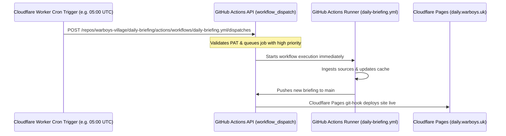

# Guide: Triggering Daily Briefings on Time with a Cloudflare Worker

GitHub Actions' built-in `schedule` (cron) runs on a best-effort queue with no execution SLA. During periods of high load, scheduled jobs can be delayed by several hours.

By offloading the cron schedule to a free **Cloudflare Worker**, you can trigger the GitHub Actions workflow precisely on time using GitHub's **`workflow_dispatch`** REST API. Because GitHub prioritizes `workflow_dispatch` requests over scheduled jobs, your briefing workflow will start within seconds of the trigger time.

---

## 🏗️ Architecture Overview



---

## 📋 Step-by-Step Setup Guide

### Step 1: Create a GitHub Personal Access Token (PAT)

1. On GitHub, navigate to **Settings** &rarr; **Developer Settings** &rarr; **Personal Access Tokens** &rarr; **Fine-grained tokens** (or [click here](https://github.com/settings/tokens?type=beta)).
2. Click **Generate new token**.
3. Configure the token:
   - **Token name**: `cloudflare-cron-daily-briefing`
   - **Expiration**: 1 year (or 90 days with calendar reminder).
   - **Repository access**: Select **Only select repositories** &rarr; `warboys-village/daily-briefing`.
   - **Permissions**:
     - Under **Repository permissions**, find **Actions** and select **Read and write**.
4. Click **Generate token** and copy the resulting `github_pat_...` string.

---

### Step 2: Create the Cloudflare Worker

You can create a standalone directory or run this via `wrangler`:

```bash
mkdir -p /home/admin/code/daily-briefing-trigger
cd /home/admin/code/daily-briefing-trigger
npm init -y
npm install wrangler --save-dev
```

#### 1. Worker Configuration (`wrangler.toml`)
Create `wrangler.toml`:

```toml
name = "daily-briefing-trigger"
main = "src/index.js"
compatibility_date = "2024-01-01"

[triggers]
# 05:00 UTC = 06:00 BST (British Summer Time) / 05:00 GMT (Winter)
# Or set to whatever exact time you want the briefing generated
crons = ["0 5 * * *"]
```

#### 2. Worker Code (`src/index.js`)
Create `src/index.js`:

```javascript
export default {
  async scheduled(event, env, ctx) {
    const owner = 'warboys-village';
    const repo = 'daily-briefing';
    const workflowId = 'daily-briefing.yml';
    const branch = 'main';

    const url = `https://api.github.com/repos/${owner}/${repo}/actions/workflows/${workflowId}/dispatches`;

    console.log(`[Trigger] Triggering GitHub workflow ${workflowId} on ${owner}/${repo}...`);

    const response = await fetch(url, {
      method: 'POST',
      headers: {
        'Accept': 'application/vnd.github+json',
        'Authorization': `Bearer ${env.GITHUB_PAT}`,
        'User-Agent': 'Cloudflare-Worker-DailyBriefing-Trigger',
        'X-GitHub-Api-Version': '2022-11-28',
        'Content-Type': 'application/json'
      },
      body: JSON.stringify({
        ref: branch
      })
    });

    if (!response.ok) {
      const errorText = await response.text();
      console.error(`[Trigger] GitHub dispatch failed (${response.status}): ${errorText}`);
      throw new Error(`GitHub dispatch failed with HTTP ${response.status}: ${errorText}`);
    }

    console.log(`[Trigger] Successfully dispatched ${workflowId} to GitHub Actions (HTTP ${response.status}).`);
  },

  // Optional: Allow manual HTTP test endpoint via browser/curl
  async fetch(request, env, ctx) {
    return new Response("Daily Briefing Trigger Worker is healthy. Triggers on cron schedule: 0 5 * * *", {
      headers: { "Content-Type": "text/plain" }
    });
  }
};
```

---

### Step 3: Store the GitHub PAT in Cloudflare Secret

Run the following command to securely upload the token to Cloudflare without checking it into Git:

```bash
npx wrangler secret put GITHUB_PAT
```
When prompted, paste the `github_pat_...` token copied in Step 1.

---

### Step 4: Deploy the Worker

Deploy the Worker to your Cloudflare account:

```bash
npx wrangler deploy
```

Once deployed:
1. In the **Cloudflare Dashboard**, navigate to **Workers & Pages** &rarr; `daily-briefing-trigger`.
2. Under **Triggers**, verify the Cron Trigger is active (e.g. `0 5 * * *`).
3. You can click **Test / Run** in the dashboard to test execution immediately and check the **Actions** tab on your GitHub repository.

---

## ⚡ Temporary Workaround in Repository

While setting up the Cloudflare Worker, the repository's internal GitHub cron has been updated in `.github/workflows/daily-briefing.yml` to:

```yaml
  schedule:
    - cron: '42 3 * * *' # Run daily at 03:42 AM UTC
```

**Why 03:42 UTC?**
1. **Avoids the `:00` Spike**: Thousands of repositories run jobs at the exact start of every hour. Running at minute `:42` skips runner queue contention.
2. **Built-in Buffer**: Scheduling at 03:42 UTC (04:42 BST) ensures that even if GitHub incurs a 1–2 hour delay during peak usage, the briefing still generates well before 06:00–07:00 AM local time.
