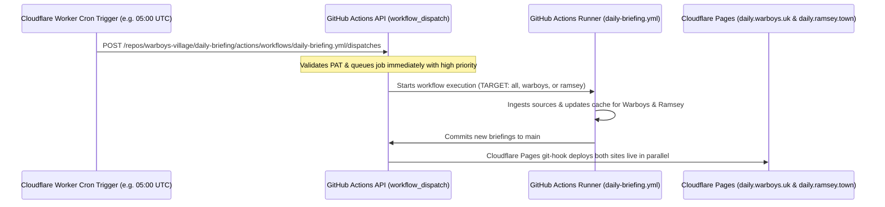

# Guide: Triggering Daily Briefings with a Cloudflare Worker

GitHub Actions' built-in `schedule` (cron) runs on a best-effort queue with no execution SLA. During periods of peak load, scheduled jobs can be delayed by several hours.

By offloading the cron schedule to a free **Cloudflare Worker**, you can trigger the GitHub Actions workflow precisely on time using GitHub's **`workflow_dispatch`** or **`repository_dispatch`** REST API. Because GitHub prioritizes external dispatch requests over scheduled jobs, your briefing workflow will start within seconds of the trigger time.

---

## 🏗️ Architecture Overview



---

## 📋 Ready-to-Deploy Worker in Repository

This repository includes a ready-to-deploy worker in [`cloudflare-worker/`](file:///home/admin/code/village-daily/cloudflare-worker/):
- **[`cloudflare-worker/wrangler.toml`](file:///home/admin/code/village-daily/cloudflare-worker/wrangler.toml)**: Configured with `[triggers]` for `0 5 * * *` (05:00 UTC = 06:00 BST in Summer / 05:00 GMT in Winter).
- **[`cloudflare-worker/index.js`](file:///home/admin/code/village-daily/cloudflare-worker/index.js)**: Handles both cron executions (`scheduled`) and on-demand HTTP webhook triggers (`POST /trigger?target=all|warboys|ramsey`).

---

## 🚀 Setup Steps

### Step 1: Create a GitHub Personal Access Token (PAT)

1. On GitHub, navigate to **Settings** &rarr; **Developer Settings** &rarr; **Personal Access Tokens** &rarr; **Fine-grained tokens** (or [click here](https://github.com/settings/tokens?type=beta)).
2. Click **Generate new token**.
3. Configure the token:
   - **Token name**: `cloudflare-cron-daily-briefing`
   - **Repository access**: Select **Only select repositories** &rarr; `warboys-village/daily-briefing`.
   - **Permissions**: Under **Repository permissions**, find **Actions** and select **Read and write**.
4. Click **Generate token** and copy the resulting `github_pat_...` string.

---

### Step 2: Deploy the Cloudflare Worker

From the root of this repository:

```bash
cd cloudflare-worker
npx wrangler secret put GITHUB_PAT
# Paste your github_pat_... when prompted

npx wrangler deploy
```

---

### Step 3: Supported Trigger Methods

The `.github/workflows/daily-briefing.yml` workflow supports three external triggering mechanisms:

#### Option A: `workflow_dispatch` (Default & Recommended)
Dispatches via the GitHub workflow endpoint:
```bash
curl -X POST \
  -H "Accept: application/vnd.github+json" \
  -H "Authorization: Bearer <GITHUB_PAT>" \
  -H "X-GitHub-Api-Version: 2022-11-28" \
  https://api.github.com/repos/warboys-village/daily-briefing/actions/workflows/daily-briefing.yml/dispatches \
  -d '{"ref":"main","inputs":{"target":"all"}}'
```
*Note: Set `target` to `"all"`, `"warboys"`, or `"ramsey"`.*

#### Option B: `repository_dispatch`
Dispatches via the repository event endpoint:
```bash
curl -X POST \
  -H "Accept: application/vnd.github+json" \
  -H "Authorization: Bearer <GITHUB_PAT>" \
  -H "X-GitHub-Api-Version: 2022-11-28" \
  https://api.github.com/repos/warboys-village/daily-briefing/dispatches \
  -d '{"event_type":"daily-briefing-trigger","client_payload":{"target":"all"}}'
```

#### Option C: Via the Deployed Cloudflare Worker HTTP Endpoint
```bash
curl -X POST https://daily-briefing-cron-trigger.<your-subdomain>.workers.dev/trigger?target=all
```

---

## ⏱️ Customizing the Trigger Schedule

To adjust the scheduled run time, edit `cloudflare-worker/wrangler.toml`:
```toml
[triggers]
crons = ["0 5 * * *"] # 05:00 AM UTC
```
Then re-run `npx wrangler deploy`.
